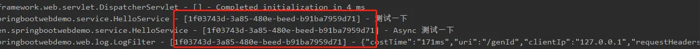

# Springboot集成轻量级链路追踪traceId


线上环境当出现报障问题需要排查时经常需要到日志中捞出有用的日志，但是线上用户量往往是很大的，从大量的请求日志中找出同个请求相关的日志是我们需要做的。traceId是通过在每一个会话请求中生成唯一的 ID，在该请求会话中所产生的一切日志都带有相同的traceId，同时每个请求会话不管成功或失败，都会将该traceId同步在请求结果中返回。


<figure><figcaption></figcaption></figure>

### MDC

MDC定义 Mapped Diagnostic Context，即：映射诊断环境。

MDC是 log4j 和 logback 提供的一种方便在多线程条件下记录日志的功能。

MDC 可以看成是一个与当前线程绑定的哈希表，可以往其中添加键值对。

MDC的使用方法

​ 向MDC设置值：MDC.put(key, value);

​ 从MDC中取值：MDC.get(key);

​ 将MDC中的内容打印到日志中：%X{key};

## 初始化TraceId并向MDC设置值

我们利用切面，在方法的执行前设置MDC，方法执行后清除MDC。具体实现方式有很多，如过滤器、拦截器、AOP等等。个人比较推荐Filter实现，因为Filter是请求最先碰到的，也是响应给前端前最后一个碰到的。

### 过滤器的实现方式


```java
@Slf4j
@WebFilter(filterName = "traceIdFilter", urlPatterns = "/*")
@Order(0)
@Component
public class TraceIdFilter implements Filter {
    /**
     * 日志跟踪标识
     */
    public static final String TRACE_ID = "TRACE_ID";

    @Override
    public void init(FilterConfig filterConfig) {
    }

    @Override
    public void doFilter(ServletRequest servletRequest, ServletResponse servletResponse, FilterChain filterChain)
            throws IOException, ServletException {
        MDC.put(TRACE_ID, UUID.randomUUID().toString());
        filterChain.doFilter(servletRequest, servletResponse);
    }

    @Override
    public void destroy() {
        MDC.clear();
    }
}
```


### 拦截器实现


```java
@Component
public class TraceIdInterceptor extends HandlerInterceptorAdapter {
    private static final String TRACE_ID = "TRACE_ID";

    @Override
    public boolean preHandle(HttpServletRequest request, HttpServletResponse response, Object handler) {
        MDC.put(TRACE_ID, UUID.randomUUID().toString());
        return true;
    }

    @Override
    public void afterCompletion(HttpServletRequest request, HttpServletResponse response, Object handler, @Nullable Exception ex) {
        MDC.clear();
    }
}

@Configuration
public class WebConfig implements WebMvcConfigurer {

    @Override
    public void addInterceptors(InterceptorRegistry registry) {
        registry.addInterceptor(new TraceIdInterceptor());
    }
}
```


## 日志打印配置pattern中配置traceId

与之前的相比只是添加了\[%X{TRACE\_ID}]， \[%X{\*\*\*}]是一个模板，中间属性名是我们使用MDC put进去的。

```properties
%d{yyyy-MM-dd} [%thread] %-5level %logger{50} - [%X{TRACE_ID}] - %msg%n
```

## 异步方法的日志打印traceId

异步方法会开启一个新线程，我们想要是异步方法和主线程共用同一个traceId，首先先新建一个任务适配器MdcTaskDecorator。

```java
public class MdcTaskDecorator implements TaskDecorator {
    @Override
    public Runnable decorate(Runnable runnable) {
        Map<String, String> map = MDC.getCopyOfContextMap();
        return () -> {
            try {
                MDC.setContextMap(map);
                String traceId = MDC.get(TRACE_ID);
                if (StringUtils.isBlank(traceId)) {
                    traceId = UUID.randomUUID().toString();
                    MDC.put(TRACE_ID, traceId);
                }
                runnable.run();
            } finally {
                MDC.clear();
            }
        };
    }
}
```

在线程池配置中增加executor.setTaskDecorator(new MdcTaskDecorator())的设置

```java
@EnableAsync
@Configuration
public class ThreadPoolConfig {
    private int corePoolSize = Runtime.getRuntime().availableProcessors() + 1;
    private int maxPoolSize = corePoolSize * 2;
    private static final int queueCapacity = 50;
    private static final int keepAliveSeconds = 30;

    @Bean(name = "threadPoolTaskExecutor")
    public ThreadPoolTaskExecutor threadPoolTaskExecutor() {
        ThreadPoolTaskExecutor executor = new ThreadPoolTaskExecutor();
        executor.setMaxPoolSize(maxPoolSize);
        executor.setCorePoolSize(corePoolSize);
        executor.setQueueCapacity(queueCapacity);
        executor.setKeepAliveSeconds(keepAliveSeconds);
        executor.setTaskDecorator(new MdcTaskDecorator());
        executor.setRejectedExecutionHandler(new ThreadPoolExecutor.CallerRunsPolicy());
        return executor;
    }
}
```

使用指定的线程池执行业务代码

```java
@Async("threadPoolTaskExecutor")
public void testThreadPoolTaskExecutor(){
    log.info("Async 测试一下");
}
```

### 在响应DTO中返回traceId

```java
@Data
@AllArgsConstructor
public class RetResult<T> {

    private Integer code;

    private String msg;

    private T data;

    private String traceId;

    public RetResult(Integer code, String msg, T data) {
        this.code = code;
        this.msg = msg;
        this.data = data;
        this.traceId = MDC.get(TRACE_ID);
    }

    public static <T> RetResult<T> success(T t) {
        return new RetResult<>(RetCode.SUCCESS.getCode(), "ok", t);
    }

    public static <T> RetResult<T> success() {
        return new RetResult<>(RetCode.SUCCESS.getCode(), "ok", null);
    }

    public static <T> RetResult<T> fail() {
        return new RetResult<>(RetCode.FAIL.getCode(), "fail", null);
    }

    public static <T> RetResult<T> fail(String msg) {
        return new RetResult<>(RetCode.FAIL.getCode(), msg, null);
    }

    public static <T> RetResult<T> fail(Integer code, String msg) {
        return new RetResult<>(code, msg, null);
    }

}
```
